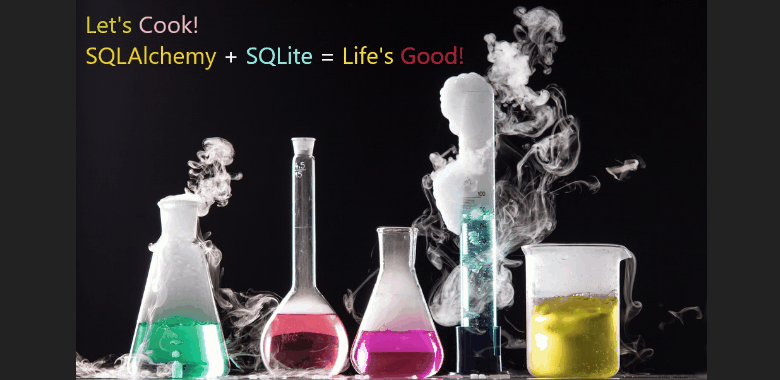
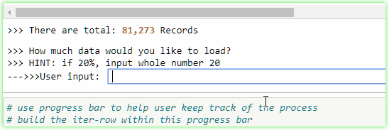

# Let's Cook! &nbsp; --> Extract --> Transform --> Load
## 1. Background
Data is not always "clean" to be analyzed, plotted or even for machine learning. In this project, two `.csv` files were downloaded from Kaggle that have several issues such as missing values, datetime format, datatype mismatch, etc. A team of two: ***Henry Le*** and ***Abimbola Agunloye*** utilized Python to perform Extract, Transform and Load operations to resolve mentioned issues. Cleaned version of data is then loaded into SQLite DataBase.

  

  

&nbsp; &nbsp; &nbsp; <i></i>

  
## 2. Languages, Tools & Technologies
* **Languages:** 
  * Python | SQL
* **Python Libraries/ Modules:**
  * SQLAlchemy | SQLite3 | Pandas | TQDM | Numpy | Datetime | CSV | OS
* **SQL Database:**
  * SQLite
* **Software/ Applications:**
  * Visual Studio Code | Jupyter Notebook
* **Operating Systems:**
  * Windows 10 Pro

## 3. Table of Content (master branch)

Folders/ Files | Descriptions
---- | ----- 
Pictures | pictures of finished loaded SQLite Database, Progress Bar, and Readme gif files
 agun_netflix.ipynb | ETL developed by A. Agunloye on Netflix Movies data 
 hle_IMDb.ipynb | ETL developed by H. Le on IMDb Movies data, also included Python ORM to load data to SQLite 

## 4. Process Overview
### 4.1 Data (Extract) 
Two movies datasets were downloaded from Kaggle:
* Netflix: https://www.kaggle.com/shivamb/netflix-shows  
* IMDB : https://www.kaggle.com/PromptCloudHQ/imdb-data 
  
### 4.2 Data Cleanup & Analysis (Transform)  
After two datasets were downloaded, performed data transformation as the following:  

#### IMDb File  (by: **Henry Le**)
* Convert data: empty string to number, float to integer, string to date.
* Replacing data: replace letters in '**id**' column with empty string, '**$**' for '**USD**' currency, **fill_na** for missing data.  
* Split data: currency and value into two columns.  
* Break up one columns to multiple ones.
* Re-name and re-arrange columns.
* Create Python Table Class to directly load data into SQLite DB.

#### Netflix File  (by: **Abimbola Agunloye**)
* Drop un-necessary columns.  
* Extract data, month, year from one columns and split into 3 columns.  
* Convert string (object) dtype to integer with numpy.  
* Split entire database into 'tv_show' and 'movie' based on column 'type'.  
* Re-name and re-arrange columns. 
* Export cleaned data to CSV and get ready for loading into SQL Lite.
 
### 4.3 Loading Data in to SQL Lite (Load)
#### DataBase Selection  
Since downloaded data is relational database, SQL Lite is chosen for the project instead of un-relational DB like MongoDB.  

The following tables are loaded into SQL Lite:  
* **imdb_movies.csv**  
* **netflix_movie.csv**  
* **netflix_tv_show.csv**  

#### Method of Loading
* **imdb_movies.csv**: SQLAlchemy with Class and Table creation to load Pandas DataFrame into SQL Lite via engine/connection.  
* **netflix_movie.csv**: manually loaded by SQL Lite -> File -> Import.  
* **netflix_tv_show.csv**: manually loaded by SQL Lite -> File -> Import.   

## 5. Summary
* Both downloaded datasets are not cleaned, lots of issues such as numbers mixed with strings, missing data, special characters, inconsistent data in the same columns, date time are all in one columns, etc. These create many issues with DataType mismatch upon pushing to SQLite from Python & SQLAlchemy.

* SQL Lite Limitations: can processed interger upto 8-bit by default, thus was causing errors upon using SQLAlchemy to load data. Upon intensive research online and from documentations, found the solutions to assign integer-64-bit to SQL Lite.

## 6. Other Considerations with SQLAlchemy  
* Program was built with an option to let user to select amount of data to load. This helps prevent program from crashing on slower computing devices.  

  
  

* Since the database is too large to upload to GitHub, recommend to download to local storage and use the codes in this repository to replicate the project if desired.  

* Loading data takes good amount of time especially a large one, so progress bar was built in for Jupyter Notebook and records/ progress percentage messages are added to both Jupter Notebook and Python to help user track the progress, as below. Note that, the progress bar only works in Jupyter Notebook. So far, I'm unable to find any stable modules to work with both Python and Jupyter Notebook.

  

## 7. Final Loaded SQLite DB Images
<ul>
  <li>
    <a class = "btn" href="./Pictures/SQLite_DB_Pics/ETL_DB.png"><b>Click here</b>
    </a> to see all loaded table image. 
  </li>

  <li>
    <a class = "btn" href="./Pictures/SQLite_DB_Pics/ETL_DB_imdb_movies.png"><b>Click here</b>
    </a> to see the loaded <b>imdb_movies</b> table image. 
  </li>

  <li>
    <a class = "btn" href="./Pictures/SQLite_DB_Pics/ETL_DB_netflix_movie.png"><b>Click here</b>
    </a> to see the loaded <b>netflix_movie</b> table image. 
  </li>

  <li>
    <a class = "btn" href="./Pictures/SQLite_DB_Pics/ETL_DB_netflix_tv_show.png"><b>Click here</b>
    </a> to see the loaded <b>netflix_tv_show</b> image. 
  </li>
</ul>

## 8. How to Use:
* Clone this repository to local PC:
   * `git clone https://github.com/henryle-n/Extract-Transform-Load.git`
* Download Data from Kaggle (section 4.1)
* Depends on the user's folder structure, data load path in each Jupyter Notebooks may need to be re-configured.
